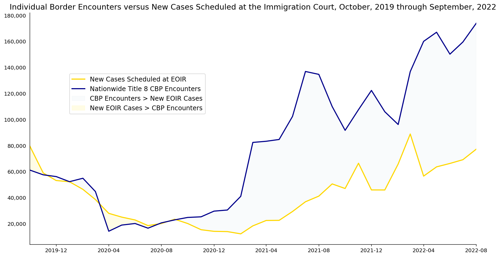

# Individual Border Encounters versus New Cases Scheduled at the Immigration Court, October, 2019 through September, 2022

Figure 1. Nationwide Customs and Border Patrol (CBP) encounters with an individual who is not expelled under Title 42 are plotted against new cases scheduled before the immigration court (EOIR). Title 42 expulsions were excluded because they do not result in removal proceedings before EOIR. CBP encounters include those logged at ports of entry (Office of Field Operations) and anywhere along a border (U.S. Border Patrol). After encountering an individual at the border and determining they are removable from the U.S., CBP must issue that individual a Notice to Appear in Immigration Proceedings (NTA), and file that NTA with the immigration court. Not all issued NTAs are filed with the immigration court.

## Viewing the Jupyter Notebook
Copy the link to the .ipynb file [ here ]( https://nbviewer.org/ ) to view the Jupyter notebook.

## Data Sources
The court data comes from [FOIA data]( https://www.justice.gov/eoir/foia-library-0 ) the immigration court publishes on their website. This is a large zip file containing an anonymized version of the court's case database. The data was cleaned and loaded into a Postgres database using [a tool I developed for this purpose]( https://github.com/bmare/CleanCsv ). It is the "Proceeding" table from the court's database which contains the dates each case was first scheduled for a hearing.

The Customs and Border Patrol data can be found [ here ]( https://www.cbp.gov/document/stats/nationwide-encounters ). Nationwide encounters were used, which includes encounters under US Codes Title 8 and Title 42. Those encountered under Title 42, the so-called "Stay-in-Mexico" policy are expelled from the country and not put in removal proceedings at the court. As such, this encounter was filtered from the dataset. 

## Understanding the Data
This data illustrates the fact that the US Immigration system is dependent on the functioning of multiple federal agencies in the Executive branch. Customs and Border Patrol is under the Department of Homeland Security, while the Executive Office for Immigration Review (EOIR) is under the Department of Justice. These two agencies do a semi-coordinated dance to conduct removal (deportation) proceedings.  

[This document](https://www.justice.gov/eoir/file/1122771/download) does well to explain the inner-workings of this dance. The following is particularly illuminating: 
>"The initiation of removal proceedings generally involves two steps. First, a component of the Department of Homeland Security (DHS) (i.e., U.S. Customs and Border Protection (CBP), U.S. Citizenship and Immigration Services (USCIS), or U.S. Immigration and Customs Enforcement (ICE)) serves an individual with a Notice to Appear (NTA) alleging that person’s removability from the United States. Second, DHS files that NTA with an immigration court. Jurisdiction with the court does not vest until the NTA is filed. 8 CFR § 1003.14(a). Consequently, although DHS may serve the NTA to an individual with a time and date for a hearing on it, the immigration court does not actually acquire jurisdiction—and, thus, the case is not actually “scheduled” and no record of proceedings exists—until DHS files the NTA with the court."

So when CBP encounters someone at the border and processes them under 8 USC, the NTA they give them does not mean their case has been docketed with the immigration court. It is not until CBP delivers that NTA to the court and the court inputs it into their system that an immigrant could be said to be in removal proceedings.

As you can see in Figure 1, there are not merely as many cases in the court as there are people who CBP processes under 8 USC. There are thousands of people whose NTAs will likely never be filed with the court. 

